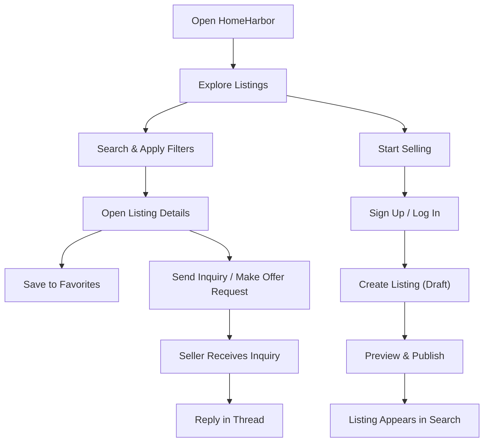

## 1. Product Overview
HomeHarbor is a mobile-first real estate marketplace where people can discover, buy, and sell houses, apartments, and land.  
It focuses on fast search, trustworthy listing details, and a simple “list your property” flow that works for everyone.

## 2. Core Features

### 2.1 User Roles
| Role | Registration Method | Core Permissions |
|------|---------------------|------------------|
| Visitor | None | Browse listings, search/filter, view listing details |
| Registered User | Email + password | Save favorites, make inquiries, create and manage listings |
| Admin (optional) | Internal | Moderate listings and users, handle reports |

### 2.2 Feature Modules
1. **Explore**: featured listings, quick categories (House / Apartment / Land), location shortcuts, trending searches
2. **Search & Filters**: price range, property type, bedrooms, land size, amenities, “near me”, sort by relevance/newest/price
3. **Listing Details**: photos, key facts, map area, seller info, inquiry/offer CTA, similar listings
4. **Favorites**: save/unsave listings, organize by type, quick re-open
5. **Sell (List Property)**: guided listing creation, photo links, pricing, location, publish/unpublish, edit
6. **Inquiries**: contact seller/agent, track sent inquiries, basic message thread per listing
7. **Account**: profile, security, your listings, settings

### 2.3 Page Details
| Page Name | Module Name | Feature description |
|-----------|-------------|---------------------|
| Explore | Featured + categories | Curated cards, type chips, location suggestions, “recently viewed” |
| Search | Filters + results | Sticky filter bar, fast list view, sort, empty-state guidance |
| Listing Details | Gallery + facts | Swipeable gallery, structured facts, map area, inquiry panel |
| Favorites | Saved lists | Saved cards with price changes badge (future), quick filters |
| Sell | Create listing | Step-by-step form, validation, save draft, preview, publish |
| Inquiries | Threads | Thread per listing, message status, contact card |
| Account | Profile + management | Your listings CRUD, auth, basic preferences |

## 3. Core Process
- A visitor lands on Explore, searches by location/type, filters results, and opens Listing Details.
- From Listing Details, the user can save a listing or contact the seller to schedule a viewing / make an offer.
- A seller registers, creates a listing via the Sell flow, publishes it, and receives inquiries.

## 4. User Interface Design
### 4.1 Design Style
- Visual direction: calm editorial minimalism (luxury-but-friendly), optimized for one-handed mobile use
- Primary colors: warm off-white background, charcoal text, deep evergreen accent
- UI surfaces: soft-bordered cards, subtle elevation, strong whitespace rhythm
- Buttons: rounded-rectangle, clear primary CTA, tactile pressed state
- Typography: display serif for headings + neutral sans for body (avoid system-default look)
- Layout: bottom navigation on mobile, top navigation on desktop; cards and sticky filter rail
- Icon style: line icons (lucide), consistent stroke, no decorative emoji as UI chrome

### 4.2 Page Design Overview
| Page Name | Module Name | UI Elements |
|-----------|-------------|-------------|
| Explore | Hero search | Large search field, location chip, category chips, featured carousel |
| Search | Results list | Sticky filters, result count, clean cards with photo + key facts |
| Listing Details | Gallery | Full-width swipe gallery, pinned CTA bar (inquiry / save) |
| Sell | Form steps | Stepper, inline validation, draft autosave feedback, preview modal |
| Favorites | Saved cards | Quick filters, empty state with suggested actions |
| Inquiries | Thread | Message bubbles, listing context header, seller contact card |

### 4.3 Responsiveness
- Mobile-first with touch-optimized targets, bottom nav, sticky CTAs, and reduced visual density
- Tablet/desktop adapts to 2–3 column grids, side filter panel, and wider gallery layouts
