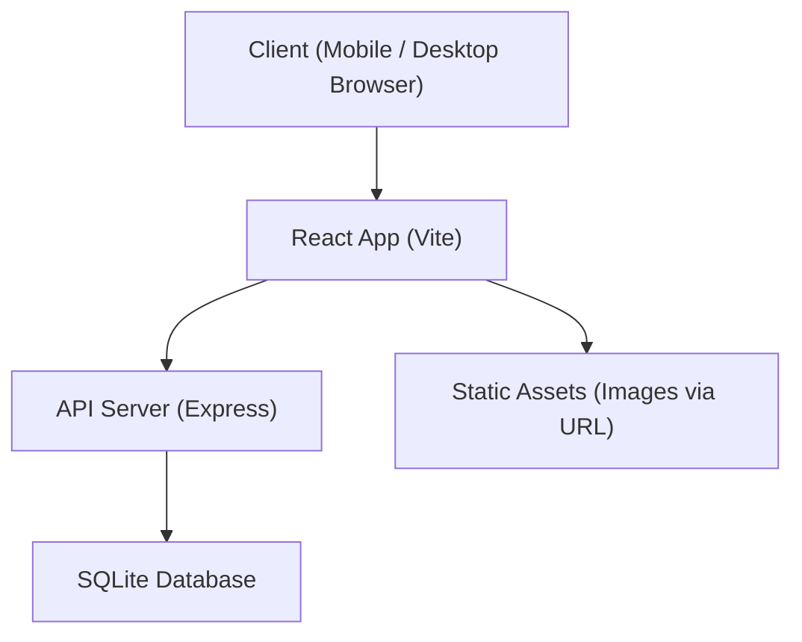
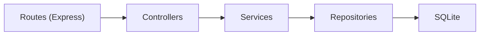
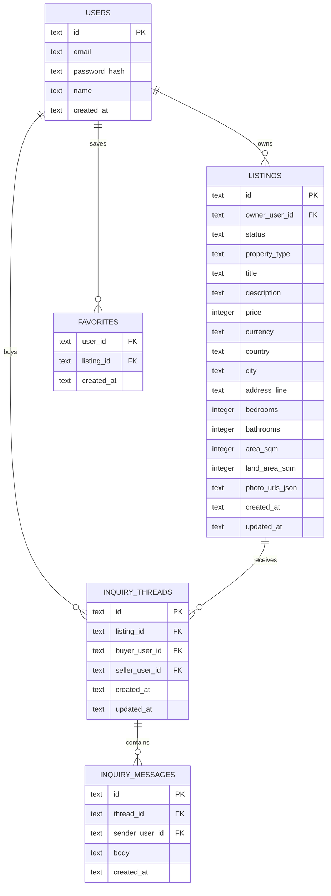

## 1. Architecture Design



## 2. Technology Description
- Frontend: React@18 + TypeScript + react-router-dom + tailwindcss
- State: zustand (UI state, auth session, cached queries)
- Backend: Express@4 (TypeScript, ESM), REST API
- Database: SQLite (local file for dev), migrations as SQL files
- Auth: email/password with hashed passwords, cookie or bearer token (MVP can start with bearer token)

## 3. Route Definitions
| Route | Purpose |
|-------|---------|
| / | Explore page (featured listings + entry search) |
| /search | Search results with filters and sorting |
| /listing/:listingId | Listing details + inquiry CTA |
| /sell | Seller dashboard (your listings) |
| /sell/new | Create listing |
| /sell/:listingId/edit | Edit listing |
| /favorites | Saved listings |
| /inquiries | Inquiry threads list |
| /inquiries/:threadId | Inquiry thread |
| /auth/login | Log in |
| /auth/signup | Create account |
| /account | Profile + settings |

## 4. API Definitions

### 4.1 Shared Types (TypeScript)
```ts
export type PropertyType = "house" | "apartment" | "land"

export type ListingStatus = "draft" | "published" | "archived"

export type Listing = {
  id: string
  ownerUserId: string
  status: ListingStatus
  propertyType: PropertyType
  title: string
  description: string
  price: number
  currency: "USD"
  country: string
  city: string
  addressLine?: string
  bedrooms?: number
  bathrooms?: number
  areaSqm?: number
  landAreaSqm?: number
  photoUrls: string[]
  createdAt: string
  updatedAt: string
}

export type User = {
  id: string
  email: string
  name: string
  createdAt: string
}

export type InquiryThread = {
  id: string
  listingId: string
  buyerUserId: string
  sellerUserId: string
  createdAt: string
  updatedAt: string
}

export type InquiryMessage = {
  id: string
  threadId: string
  senderUserId: string
  body: string
  createdAt: string
}
```

### 4.2 Endpoints (MVP)
| Method | Path | Purpose |
|--------|------|---------|
| POST | /api/auth/signup | Create account |
| POST | /api/auth/login | Authenticate |
| GET | /api/me | Current user |
| GET | /api/listings | Search listings (filters + sorting + pagination) |
| GET | /api/listings/:id | Get listing details |
| POST | /api/listings | Create listing (draft) |
| PATCH | /api/listings/:id | Update listing |
| POST | /api/listings/:id/publish | Publish listing |
| POST | /api/listings/:id/archive | Archive listing |
| GET | /api/favorites | Get favorites |
| POST | /api/favorites/:listingId | Add favorite |
| DELETE | /api/favorites/:listingId | Remove favorite |
| POST | /api/inquiries | Start inquiry thread + first message |
| GET | /api/inquiries | Get inquiry threads for user |
| GET | /api/inquiries/:threadId/messages | Get thread messages |
| POST | /api/inquiries/:threadId/messages | Send message |

## 5. Server Architecture Diagram


## 6. Data Model

### 6.1 Data Model Definition


### 6.2 Data Definition Language
```sql
CREATE TABLE IF NOT EXISTS users (
  id TEXT PRIMARY KEY,
  email TEXT NOT NULL UNIQUE,
  password_hash TEXT NOT NULL,
  name TEXT NOT NULL,
  created_at TEXT NOT NULL
);

CREATE TABLE IF NOT EXISTS listings (
  id TEXT PRIMARY KEY,
  owner_user_id TEXT NOT NULL,
  status TEXT NOT NULL,
  property_type TEXT NOT NULL,
  title TEXT NOT NULL,
  description TEXT NOT NULL,
  price INTEGER NOT NULL,
  currency TEXT NOT NULL,
  country TEXT NOT NULL,
  city TEXT NOT NULL,
  address_line TEXT,
  bedrooms INTEGER,
  bathrooms INTEGER,
  area_sqm INTEGER,
  land_area_sqm INTEGER,
  photo_urls_json TEXT NOT NULL,
  created_at TEXT NOT NULL,
  updated_at TEXT NOT NULL,
  FOREIGN KEY (owner_user_id) REFERENCES users (id)
);

CREATE TABLE IF NOT EXISTS favorites (
  user_id TEXT NOT NULL,
  listing_id TEXT NOT NULL,
  created_at TEXT NOT NULL,
  PRIMARY KEY (user_id, listing_id),
  FOREIGN KEY (user_id) REFERENCES users (id),
  FOREIGN KEY (listing_id) REFERENCES listings (id)
);

CREATE TABLE IF NOT EXISTS inquiry_threads (
  id TEXT PRIMARY KEY,
  listing_id TEXT NOT NULL,
  buyer_user_id TEXT NOT NULL,
  seller_user_id TEXT NOT NULL,
  created_at TEXT NOT NULL,
  updated_at TEXT NOT NULL,
  FOREIGN KEY (listing_id) REFERENCES listings (id),
  FOREIGN KEY (buyer_user_id) REFERENCES users (id),
  FOREIGN KEY (seller_user_id) REFERENCES users (id)
);

CREATE TABLE IF NOT EXISTS inquiry_messages (
  id TEXT PRIMARY KEY,
  thread_id TEXT NOT NULL,
  sender_user_id TEXT NOT NULL,
  body TEXT NOT NULL,
  created_at TEXT NOT NULL,
  FOREIGN KEY (thread_id) REFERENCES inquiry_threads (id),
  FOREIGN KEY (sender_user_id) REFERENCES users (id)
);

CREATE INDEX IF NOT EXISTS idx_listings_city ON listings(city);
CREATE INDEX IF NOT EXISTS idx_listings_type ON listings(property_type);
CREATE INDEX IF NOT EXISTS idx_listings_status ON listings(status);
CREATE INDEX IF NOT EXISTS idx_inquiry_threads_listing ON inquiry_threads(listing_id);
```
